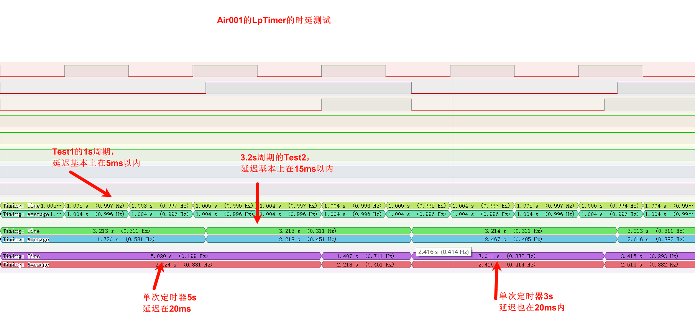
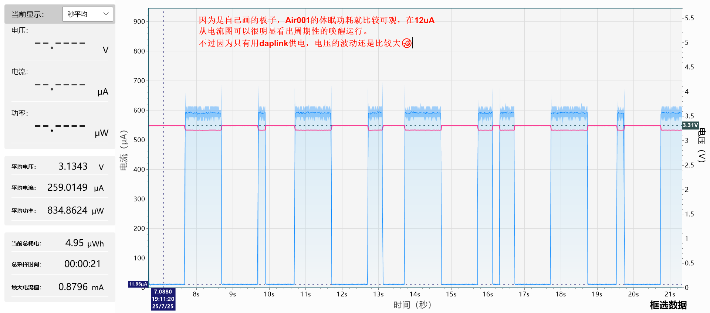
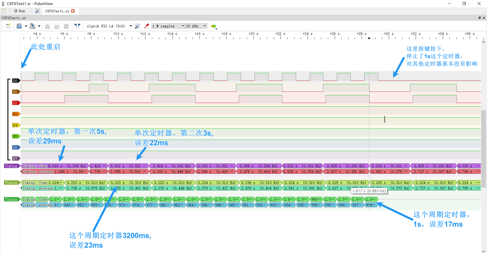
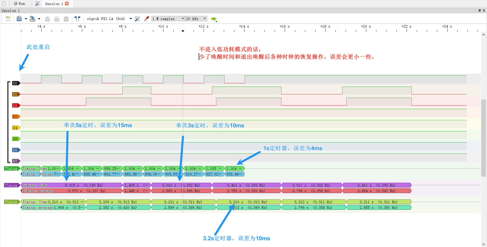
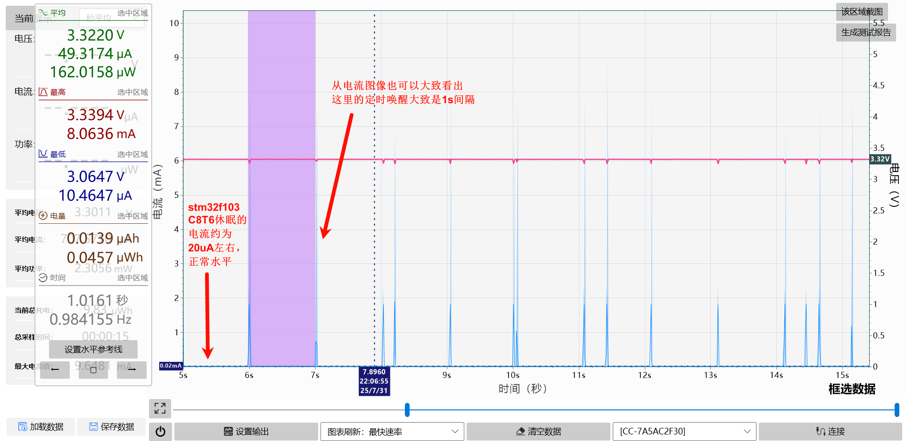

# 测试案例

## 文件结构

```markdown
Examples
|-->Air001_LPTimer(使用低功耗定时器作为LpTimer库时基，Air001作为主控的例子)
    |-->TestData(测试数据的截图，包括逻辑分析仪抓到的IO翻转和功率分析仪抓到的电流电压数据截图)
	|...(每个芯片的sdk不一样，所以这里的子文件省略)
|-->F103RCT6_RTC(使用RTC作为LpTimer库时基，stm32f103C8t6作为主控的例子)
	|-->TestData(测试数据的截图，包括逻辑分析仪抓到的IO翻转和功率分析仪抓到的电流电压数据截图)
	|...(每个芯片的sdk不一样，所以这里的子文件省略)
```

## 测试结果说明

### Air001测试结果如下：

因为Air001是自己画的板子，功耗表现正常(休眠时大概12uA的电流，比手册写的略大)，只有在LpTimer的定时器到期的时候才唤醒执行，平时都是休眠状态。





### stm32f103c8t6(小蓝板)测试结果如下：

C8T6测试了休眠和不休眠情况下，定时器唤醒的时间间隔误差(通过逻辑分析仪抓IO翻转判断)。

C8T6休眠的电流大概在24uA左右([符合之前有大佬在网上公开的测试情况](https://shequ.stmicroelectronics.cn/thread-641697-1-1.html)，虽然比手册提供的要大)。






