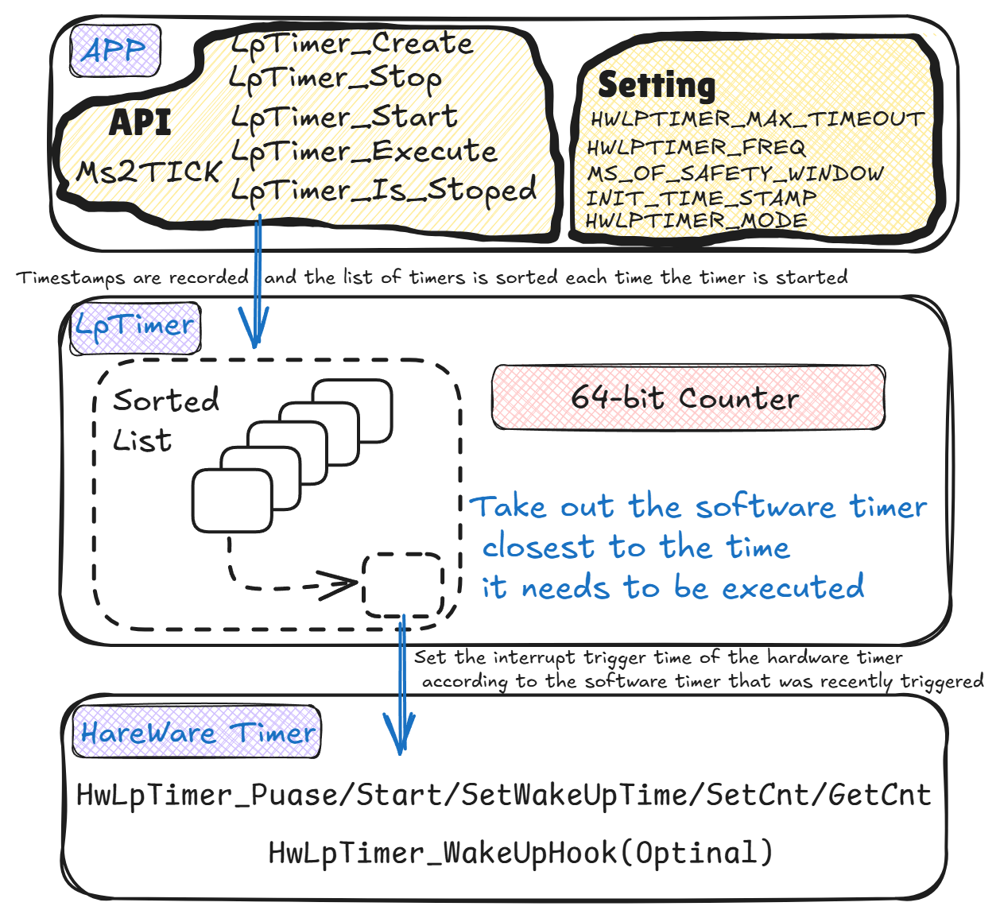
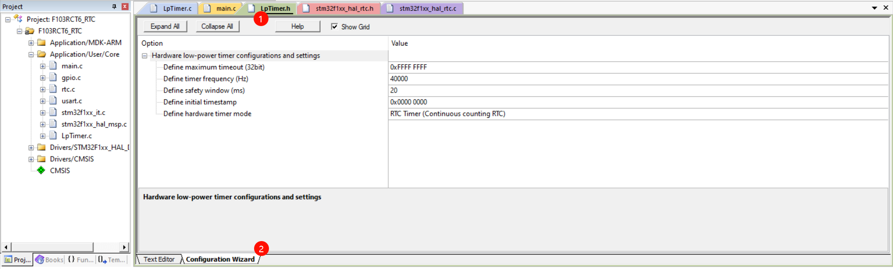

# LpTimer，一个可以在定时间隔休眠的软件定时器

## LpTimer的灵感来源

因为体验过nrf-sdk中的app-timer，所以，在其他芯片上想要进行裸机的低功耗编程时，会自然的想要有类似app-timer那样能够支持在定时间隔期间休眠的软件定时器库能够使用，但找了一下，貌似只有Free-RTOS中的tick-less实现了类似的功能(但tick默认使用的是systick定时器来作为底层中断的硬件定时器，但大部分芯片的stop模式是不支持systick中断唤醒的)。

因此，我写了LpTimer这个软件定时器库，它有以下特点

- **(理论上)创建无数多个软件定时器，定时器间互不影响**
- **在没有定时器运行期间可以让主控休眠(stop模式休眠，维持全RAM数据下功耗最低的休眠模式)**
- **单独软件定时器功能，代码量小，仅有一个.h文件，可用于RAM小的裸机编程**
- **底层支持RTC Alarm和普通LowPower Timer溢出两种类型的定时器中断，作为硬件定时器的实现**

## LpTimer的移植和接口说明

LpTimer由于代码量不大，只有`LpTimer.h` 一个文件，且这个文件包含注释和空行仅有318行左右，因此，效仿了著名的[C/C++单文件开源库stb](https://github.com/nothings/stb/tree/master)的做法。

### LpTimer的移植

1. 需要找一个文件实现LpTimer底层硬件定时器的接口函数(**这里建议可以复制`LpTimer_Implement_Template.c` 这个文件，并实现里面的几个接口函数函数体的内容即可**)。底层硬件定时器的接口函数有以下六个(最后一个可以不实现，不影响功能的正常使用)：

   - `static void HwLpTimer_Puase(void)` : 暂停硬件定时器的接口函数
   - `static void HwLpTimer_Start(void)` : 启动硬件定时器的接口函数
   - `static void HwLpTimer_SetWakeUpTime(uint32_t period)` : 设置硬件定时器中断周期的接口函数
   - `static void HwLpTimer_SetCnt(uint32_t counter)` : 设置硬件定时器当前计数器的值的接口函数
   - `static uint32_t HwLpTimer_GetCnt(void)` : 得到当前硬件定时器的计数值的接口函数
   - `static void HwLpTimer_WakeUpHook(void* p_context)` : 唤醒任何一个LpTImer后会执行的hook回调函数 (可以用于低功耗模式下配置唤醒后的时钟)。

   需要注意的是和stb单文件移植一样，需要在LpTimer具体实现的文件中包含`LpTimer.h` 之前定义 `LPTIMER_IMPLEMENT` 这个宏，具体可以参考`LpTimer_Implement_Template.c` 这个文件。

2. 根据硬件定时配置`LpTimer.h` 中的配置项，该配置项支持keil中可视化配置，如下图所示：

   

   下面解释下每个配置项的意思(其实keil配置中都有具体的英文说明)：
   - `HWLPTIMER_MAX_TIMEOUT`宏(`Define maximum timeout`  选项): 硬件定时器的最大溢出值是多少，最大只能是32bit，默认值是32bit的最大值 0xFFFFFFFF。
   - `HWLPTIMER_FREQ`宏(`Define timer frequency` 选项): 硬件定时器的工作频率(即Counter自增的时钟频率)，单位是Hz，默认值是40000(40kHz)，范围必须在100Hz到100kHz之间。
   - `MS_OF_SAFETY_WINDOW`宏(`Define safety window` 选项): 安全窗口的时间长度，单位是毫秒，默认值是20ms。该值建议设置在10ms到100ms之间。当多个定时器的deadline时间差小于安全窗口时，这些定时器的回调函数会被一起执行，以提高系统效率。
   - `INIT_TIME_STAMP`宏(`Define initial timestamp` 选项): 定时器系统的初始时间戳，默认值是0x00000000。该值必须在0到HWLPTIMER_MAX_TIMEOUT之间，通常保持默认值0即可。
   - `HWLPTIMER_MODE`宏(`Define hardware timer mode` 选项): 硬件定时器的工作模式，需要根据硬件定时器的类型做调整：
     - 模式1: RTC定时器模式(连续计数的RTC)
     - 模式2: 普通溢出事件定时器模式
     默认值为模式1。两种模式的主要区别在于中断发生后计数器的行为：RTC模式下认为硬件计数器会继续计数，而普通溢出模式下会认为硬件计数器会从0重新开始。

3. 将`LpTimer_Execute()` 函数在定时器的回调函数中执行，已处理硬件定时器任务。

至此移植完成，可以参考Examples文件夹下的两个移植的例子。[下面LpTimer移植案例](##LpTimer移植案例) 这一小节会简要说明下两个案例的一些细节，[Examples下的README文件](.\Examples\README.md)也有说明这两个案例的一些数据。

### LpTimer接口函数的使用

### LpTimer接口函数的使用

- `MS2TICK(ms)` : 将毫秒转为tick单位， 可用于LpTimer_Start的参数。
- `LPTIMER_IS_STOPED(timer)` : 用于判断定时器是否停止，返回1表示已停止，返回0表示该定时器还在运行。

- `void LpTimer_Create(LpTimer * timer, E_LPTIMER_MODE mode, void (*hook)(void))` : 
  - 创建一个新的低功耗定时器实例
  - 参数:
    - `timer`: 指向要初始化的低功耗定时器结构体指针
    - `mode`: 定时器模式，可选`E_LPTIMERMODE_ONCE`(单次模式)或`E_LPTIMERMODE_PERIODIC`(周期模式)
    - `hook`: 定时器到期时调用的回调函数

- `void LpTimer_Start(LpTimer *timer, uint32_t tick_of_timeout)` :
  - 启动指定的低功耗定时器，并设置超时时间
  - 参数:
    - `timer`: 指向低功耗定时器结构体的指针
    - `tick_of_timeout`: 超时时间，单位为tick，需要使用MS2TICK宏进行毫秒到tick的转换

- `uint8_t LpTimer_Stop(LpTimer *timer)` :
  - 停止指定的低功耗定时器
  - 参数:
    - `timer`: 指向要停止的定时器结构体指针
  - 返回值:
    - 返回0表示定时器成功停止
    - 返回1表示停止失败

- `void LpTimer_Execute(void)` :
  - 执行定时器调度器，处理定时器事件
  - 该函数需要放在硬件定时器的中断函数

### LpTimer移植案例

提供了两个案例，

- 一个是运行在stm32F103C8T6小蓝板上使用RTC作为时基，Alarm中断触发的例子。
- 另一个是运行在Air001上使用一个硬件低功耗定时器作为时基，定时器溢出中断触发的例子。

使用RTC-alram中断和低功耗定时器溢出中断的原因是，单片机的数据手册允许将这两个中断作为单片机在STOP模式下的唤醒源。

**LpTimer也可以使用普通定时器(如C8T6中的TIM6)作为定时器时基，但由于TIM6无法作为STOP模式下的唤醒源，所以如果进入STOP休眠模式，LpTimer的调度将无法唤醒。**

**LpTimer不要求使用者使用什么低功耗模式，使用者可以根据需要使用低功耗模式。但如果使用RTC-Alarm，或者大多数低功耗MCU中的低功耗定时器的溢出中断作为时基的话，能够实现在MCU定时唤醒执行的情况下达到休眠时的极低功耗。**

## LpTimer的主要思想和优缺点

### 主要思想

与一般的软件定时器不同(前后台轮询的软件定时器框架)，LpTimer只有在溢出，或者有任务执行时才会进入中断函数。

**它主要维护了一个排序列表和一个64bit的计数器变量，每次有软件定时器启动，或者周期性软件定时器执行完毕重新启动时，它会将新加入的软件定时器按照触发时间的先后关系插入排序列表中，然后再将最近一个要执行的定时器的触发时间间隔设置为硬件定时器的触发时间，如此往复，一次保证能够定期执行任务而不需要频繁的中断**。

### 优缺点

#### 优点：

- 代码量小，小巧，不妨碍系统进入低功耗模式，只在有定时器需要执行的时候才会有中断发生唤醒MCU进行定时器调度并执行对应的软件定时器回调。
- 设有安全窗口，防止因为回调函数执行耗时操作而错过软件定时器的触发。

#### 缺点：

- 目前代码实现上靠维护内部一个64bit的计数器变量，加入以40kHz作为硬件定时器的时钟的话，LpTimer的时基有可能在14千万年后溢出。

- 由于MCU在唤醒后需要进行时钟恢复之类的操作(LpTimer提供了hook函数供使用者完成这部分操作)，因此LpTimer在低功耗休眠唤醒下的定时精度只有20ms-30ms左右(同时还受任务运行时间的影响)。

  具体定时精度如何可以参考[Examples下的README文件](.\Examples\README.md) 中通过逻辑分析仪捕获的IO数据验证唤醒执行软件定时器的延迟。

